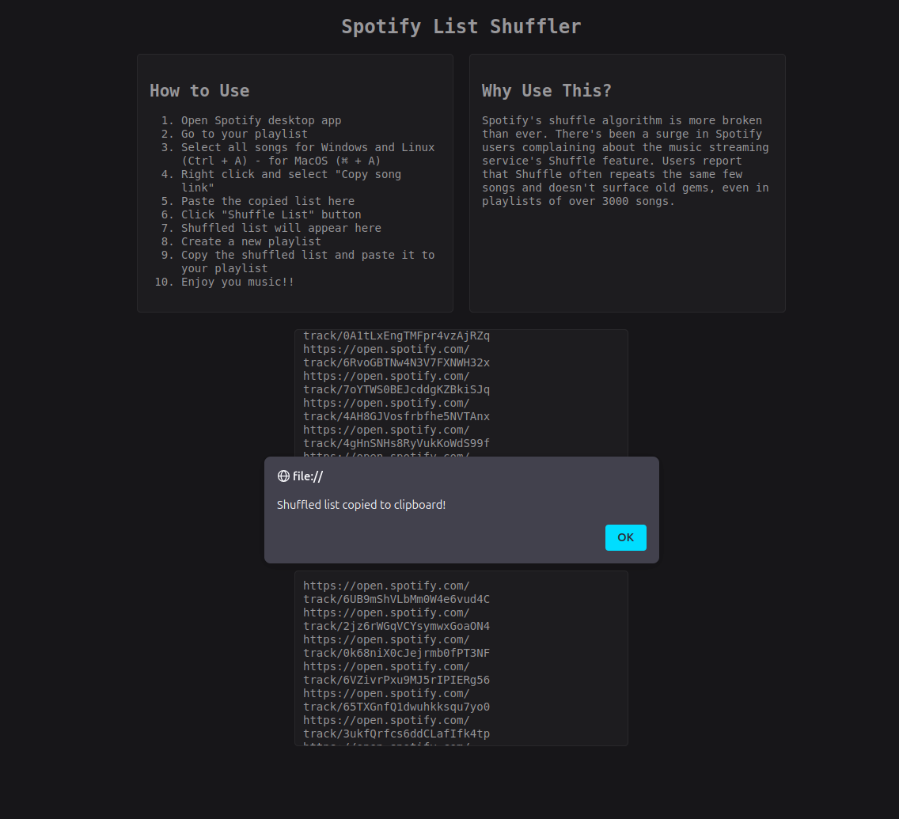

# True Random Spotify Shuffler

A simple web-based tool that fixes Spotify's broken shuffle algorithm by providing a true random shuffle for your playlists. Using the Fisher-Yates shuffle algorithm, this tool rearranges your Spotify track links to help ensure a fair distribution of songs.

## Features

- **True Random Shuffle:** Utilizes the Fisher-Yates algorithm for an unbiased random order.
- **Clipboard Integration:** Automatically copies the shuffled list to your clipboard for easy pasting back into Spotify.

## Demo

## How It Works

1. **Copy your Spotify playlist links:** Open Spotify's desktop app, select your playlist, and copy all song links.
2. **Paste into the tool:** Paste the copied list into the provided textarea.
3. **Shuffle the list:** Click the "Shuffle List" button to randomize the order.
    - The tool leverages the Fisher-Yates shuffle algorithm to ensure that every permutation is equally likely, providing a true random order for your playlist.
4. **Paste back into Spotify:** The shuffled list is automatically copied to your clipboard. Create a new playlist in Spotify and paste the list.

